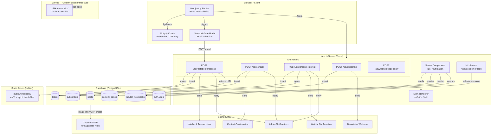
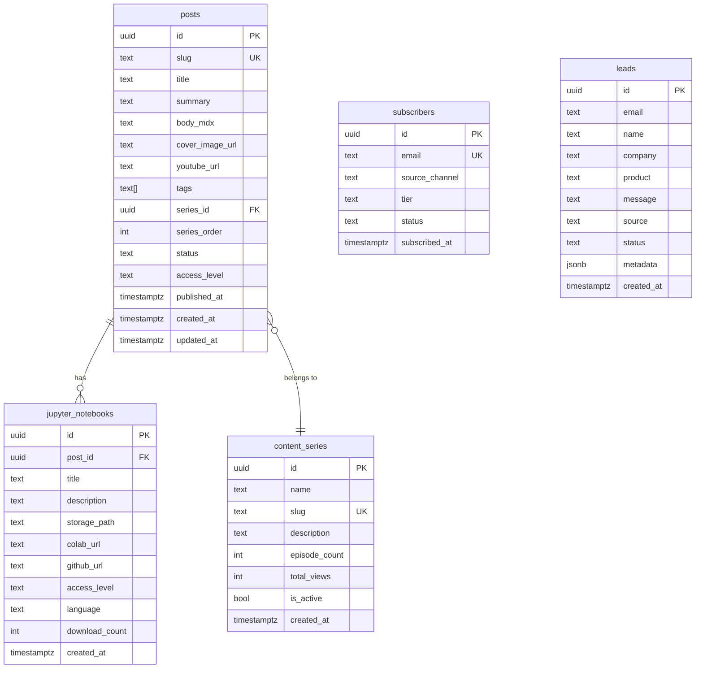

# Quanti🔥 — Quantifaya Web Platform

> **Antifragile Quantitative Intelligence for TradFi and DeFi"**
>
> A full-stack Next.js 15 marketing, content, and product platform for Quantifaya — a quantitative finance education and tooling company offering six products across traditional finance, DeFi, AI, and media.

---

## Table of Contents

1. [Overview](#overview)
2. [Architecture](#architecture)
3. [Tech Stack](#tech-stack)
4. [Project Structure](#project-structure)
5. [Products](#products)
6. [Features](#features)
   - [Landing Page](#landing-page)
   - [Blog & MDX Content](#blog--mdx-content)
   - [Jupyter Notebooks](#jupyter-notebooks)
   - [Authentication](#authentication)
   - [Email System (Resend)](#email-system-resend)
   - [Forms & Lead Capture](#forms--lead-capture)
7. [Database Schema (Supabase)](#database-schema-supabase)
8. [API Routes](#api-routes)
9. [Environment Variables](#environment-variables)
10. [Local Development](#local-development)
11. [Deployment](#deployment)
12. [Supabase SMTP Setup (Resend)](#supabase-smtp-setup-resend)

---

## Overview

Quantifaya is a **waitlist-first** platform. All products except **Quantifaya Content** (the blog/media arm) are in `coming-soon` state. Every CTA on the platform funnels users toward registering interest via a waitlist form, which captures leads into Supabase and triggers branded confirmation emails via Resend.

The platform identity:
- **Written name:** Quantifaya
- **Platform display:** Quanti🔥 (fire emoji represents "faya")
- **Domain:** quantifaya.com

---

## Architecture



---

## Tech Stack

| Layer | Technology | Version |
|---|---|---|
| Framework | Next.js (App Router) | 15.2.3 |
| Runtime | React | 19.0.0 |
| Language | TypeScript | 5.x |
| Styling | Tailwind CSS + Typography plugin | 3.4.x |
| Database & Auth | Supabase (`@supabase/ssr`) | 0.6.x |
| Email | Resend | 6.9.x |
| MDX | next-mdx-remote | 5.0.0 |
| Math rendering | KaTeX (remark-math + rehype-katex) | 0.16.x |
| Code highlighting | rehype-pretty-code + Shiki | 0.14.x / 3.2.x |
| Charts | Plotly.js / react-plotly.js | 3.4.x / 2.6.x |
| Build tool | Turbopack (`next dev --turbopack`) | — |
| Deployment | Vercel | — |

---

## Project Structure

```
quantifire-web/
├── public/
│   └── notebooks/                        # Downloadable + Colab-accessible .ipynb files
│       ├── ep01-correlation-matters.ipynb
│       └── ep11-uniswap-amm.ipynb
│
├── src/
│   ├── app/                              # Next.js App Router
│   │   ├── layout.tsx                    # Root layout — metadata, fonts, Navbar, Footer
│   │   ├── page.tsx                      # Landing page
│   │   ├── about/page.tsx
│   │   ├── contact/page.tsx
│   │   ├── marketplace/page.tsx
│   │   ├── blog/
│   │   │   ├── page.tsx                  # Blog index (ISR, 60s)
│   │   │   └── [slug]/page.tsx           # Individual post (MDX + charts + notebooks)
│   │   ├── products/
│   │   │   └── [slug]/page.tsx           # Product detail — 5 tabs + interest form
│   │   ├── auth/
│   │   │   ├── login/page.tsx            # Magic link + GitHub OAuth
│   │   │   ├── signup/page.tsx
│   │   │   └── callback/route.ts         # OAuth callback
│   │   └── api/
│   │       ├── subscribe/route.ts        # Newsletter signup → Supabase + Resend welcome
│   │       ├── contact/route.ts          # Contact form → Supabase + Resend confirmation
│   │       ├── product-interest/route.ts # Waitlist form → Supabase + Resend confirmation
│   │       ├── notebooks/
│   │       │   └── access/route.ts       # Email gate → Supabase + Resend notebook links
│   │       └── webhook/
│   │           └── openclaw/route.ts     # Content syndication webhook
│   │
│   ├── components/
│   │   ├── layout/
│   │   │   ├── Navbar.tsx                # Quanti🔥 logo, Waitlist badge, nav links
│   │   │   └── Footer.tsx                # Brand, links, copyright
│   │   ├── landing/
│   │   │   ├── Hero.tsx                  # Waitlist-first hero, trust indicators
│   │   │   ├── ProductSections.tsx       # One full section per product, alternating layout
│   │   │   ├── ProductGrid.tsx           # (legacy — replaced by ProductSections)
│   │   │   ├── NewsletterBanner.tsx      # Email subscribe banner
│   │   │   ├── ContentPreview.tsx
│   │   │   ├── ChannelStrip.tsx
│   │   │   └── SocialProof.tsx
│   │   ├── blog/
│   │   │   ├── MDXContent.tsx            # MDX renderer (KaTeX, Shiki, custom components)
│   │   │   ├── PostHeader.tsx
│   │   │   ├── PostCard.tsx
│   │   │   ├── NotebookPanel.tsx         # Notebook cards with email gate
│   │   │   ├── NotebookGate.tsx          # Email gate modal (client component)
│   │   │   ├── NewsletterCTA.tsx
│   │   │   ├── ChartBlock.tsx            # Collapsible chart wrapper
│   │   │   ├── CopyButton.tsx
│   │   │   ├── CopyableCode.tsx
│   │   │   ├── SeriesNav.tsx
│   │   │   └── charts/
│   │   │       ├── PortfolioVarianceChart.tsx   # Weight slider + vol vs correlation
│   │   │       ├── CorrelationHeatmap.tsx        # Normal vs Crisis toggle
│   │   │       ├── AMMCurveChart.tsx             # x·y=k hyperbola + trade path
│   │   │       └── PriceImpactChart.tsx          # Price impact vs trade size
│   │   ├── products/
│   │   │   ├── ProductHero.tsx           # Coming-soon / live aware CTAs
│   │   │   ├── ProductTabs.tsx           # 5 tabs + URL-driven (?tab=interest)
│   │   │   ├── PricingTable.tsx
│   │   │   └── FeatureList.tsx
│   │   └── marketplace/
│   │       ├── FilterSidebar.tsx
│   │       └── ProductCard.tsx
│   │
│   ├── content/
│   │   ├── index.ts                      # STATIC_POSTS fallback array
│   │   └── posts/
│   │       ├── ep01-correlation-matters.ts          # Post metadata + notebook metadata
│   │       ├── ep01-why-correlation-matters-more-than-returns.mdx
│   │       ├── ep11-uniswap-amm.ts
│   │       └── ep11-how-uniswap-works-xy-k-formula.mdx
│   │
│   ├── lib/
│   │   ├── products.ts                   # PRODUCTS array + getProduct(slug)
│   │   ├── resend.ts                     # Resend client + all email template functions
│   │   ├── mdx.ts                        # MDX compiler (remark-math, rehype-katex, Shiki)
│   │   ├── utils.ts
│   │   └── supabase/
│   │       ├── client.ts                 # Browser client (createBrowserClient)
│   │       ├── server.ts                 # Server client (createServerClient + cookies)
│   │       └── queries.ts                # Data access: posts, series, subscribers, leads
│   │
│   ├── types/index.ts                    # Post, JupyterNotebook, Product, Subscriber, Lead
│   └── middleware.ts                     # Session refresh + /dashboard route protection
│
├── .env.local                            # Local secrets (never committed)
├── .env.local.example                    # Template with all required vars
└── package.json
```

---

## Products

All products are **coming soon** except Quantifaya Content (live). All non-live product CTAs direct to the waitlist interest form at `/products/[slug]?tab=interest`.

| Slug | Name | Category | Status | Price From |
|---|---|---|---|---|
| `quantifaya` | Quantifaya | TradFi | Coming Soon | $299/mo |
| `yield-agent` | Yield Agent | Web3 / DeFi | Coming Soon | $49/mo |
| `quantifaya-cms` | Quantifaya CMS | Tools | Coming Soon | $99/mo |
| `legal-research-agent` | Legal Research Agent | AI | Coming Soon | Free |
| `academy` | Quantifaya Academy | Education | Coming Soon | Free |
| `content` | Quantifaya Content | Media | **Live** | Free |

### Quantifaya (TradFi Platform)
8 integrated modules: Options Pricing Engine · Portfolio Analytics · Risk Management · Portfolio Optimizer (MVO, Black-Litterman, HRP) · Volatility Lab · Factor Lab · Scenario Engine · Trade Blotter

### Yield Agent (Web3)
DeFi yield optimisation with stablecoin execution layer — automated rebalancing across AMM pools and lending protocols.

### Quantifaya CMS (Tools)
Headless CMS with agentic orchestration across 9 channels: YouTube · TikTok · Instagram · LinkedIn · Twitter/X · Discord · Reddit · WhatsApp · Blog. Includes interactive notebook management and embedding.

### Legal Research Agent (AI)
Kenyan law research assistant — statute lookup, case precedent search, compliance checklists.

### Quantifaya Academy (Education)
36+ animated episodes, interactive Jupyter notebooks, learning paths from foundations to advanced quant.

### Quantifaya Content (Media — Live)
Free research blog + premium tier with full notebooks, datasets, and backtest results.

---

## Features

### Landing Page

- **Hero** — waitlist-first messaging, trust indicators (Free to register · Early access priority · GDPR & POPIA compliant · No spam)
- **ProductSections** — one full-width section per product with alternating left/right layout, stats panel, feature list, and two CTAs:
  1. View Product → `/products/[slug]`
  2. Join Waitlist → `/products/[slug]?tab=interest`

### Blog & MDX Content

Posts are stored as `.mdx` files in `src/content/posts/` and loaded at runtime via `next-mdx-remote`. Supabase serves as the primary data store with static content as fallback.

**MDX features:**
- **LaTeX math** rendered via KaTeX (`$inline$` and `$$block$$`)
- **Syntax highlighting** via Shiki + rehype-pretty-code (One Dark Pro theme)
- **Copy button** on all code blocks (hover to reveal)
- **Interactive charts** embedded as React components within MDX

**Interactive charts (Plotly, CSR only):**

| Component | Episode | Description |
|---|---|---|
| `PortfolioVarianceChart` | EP01 | Weight slider — portfolio vol vs correlation |
| `CorrelationHeatmap` | EP01 | Normal vs Crisis correlation toggle |
| `AMMCurveChart` | EP11 | x·y=k hyperbola with trade path |
| `PriceImpactChart` | EP11 | Price impact vs trade size by fee tier |

**Content series:**
- `classical-quant` — Classical Quantitative Finance (10 episodes)
- `defi-mechanics` — DeFi Mechanics (8 episodes)

### Jupyter Notebooks

Two institutional-grade notebooks hosted in `public/notebooks/` and accessible via Colab badge.

| Notebook | File | Cells | Series |
|---|---|---|---|
| EP01 — Portfolio Correlation & Variance | `ep01-correlation-matters.ipynb` | 44 (23 code) | Classical Quant |
| EP11 — AMM Mechanics & Price Impact | `ep11-uniswap-amm.ipynb` | 49 (21 code) | DeFi Mechanics |

**Both notebooks include:**
- `CONFIG` dict at top — swap tickers/dates and "Run All" works on any dataset
- `yfinance` data fetching with quality checks and synthetic fallback
- Full EDA section: normalised price time series · log return distributions (histograms) · box plots · rolling correlation · full correlation heatmap — all interactive Plotly charts
- All mathematical formulas in LaTeX markdown cells
- Google-style docstrings on all functions and classes
- `▶ Run this cell` prompts throughout
- Academic references section

**EP01 additional sections:** Ledoit-Wolf shrinkage covariance · Monte Carlo efficient frontier · MCTR bar chart · Crisis stress-test (normal vs COVID correlation matrices) · Full HRP implementation (tree clustering → quasi-diagonalisation → recursive bisection)

**EP11 additional sections:** Full `UniswapV2Pool` dataclass · invariant verification · x·y=k hyperbola plot · price impact curves · impermanent loss derivation + break-even fee analysis · `UniswapV3Position` class · capital efficiency comparison across range widths

**Email gate:** Users must provide their email before downloading or opening in Colab. The gate:
1. Collects email (+ optional name) via `NotebookGate` modal
2. POSTs to `/api/notebooks/access`
3. Upserts subscriber in Supabase
4. Emails permanent download + Colab links via Resend
5. Returns URLs to frontend — Colab opens in new tab / download triggers automatically

**Colab URLs** (requires public GitHub push to `Godwin-88/quantifire-web`):
```
https://colab.research.google.com/github/Godwin-88/quantifire-web/blob/main/public/notebooks/ep01-correlation-matters.ipynb
https://colab.research.google.com/github/Godwin-88/quantifire-web/blob/main/public/notebooks/ep11-uniswap-amm.ipynb
```

### Authentication

Supabase Auth with:
- **Magic link (OTP)** — passwordless email sign-in via `supabase.auth.signInWithOtp()`
- **GitHub OAuth** — `supabase.auth.signInWithOAuth({ provider: 'github' })`
- **Callback route** — `/auth/callback` exchanges OAuth code for session
- **Route protection** — middleware redirects unauthenticated users away from `/dashboard`
- **Auth emails** routed through Resend SMTP (see [setup below](#supabase-smtp-setup-resend))

### Email System (Resend)

All transactional emails use the `resend` SDK (`src/lib/resend.ts`). All templates are dark-themed HTML matching the Quantifaya brand.

| Function | Trigger | Recipients |
|---|---|---|
| `sendContactConfirmation` | Contact form submit | User |
| `sendContactAdminNotification` | Contact form submit | Admin |
| `sendNewsletterWelcome` | Newsletter subscribe | User |
| `sendWaitlistConfirmation` | Product interest form | User |
| `sendWaitlistAdminNotification` | Product interest form | Admin |
| Notebook access email (inline) | Notebook gate submit | User |
| Notebook admin alert (inline) | Notebook gate submit | Admin |
| Supabase auth emails | Magic link / OTP | User (via Resend SMTP) |

**Free tier:** 3,000 emails/month · 100/day. Sufficient for early waitlist phase.

### Forms & Lead Capture

All form submissions save to Supabase and trigger Resend emails.

| Form | Location | Supabase table | Source field |
|---|---|---|---|
| Newsletter subscribe | Landing banner, blog CTA | `subscribers` | `landing-banner` / `blog-cta` |
| Contact | `/contact` | `leads` | `contact-page` |
| Product interest / waitlist | `/products/[slug]?tab=interest` | `leads` + `subscribers` | `product-interest-form` |
| Notebook access gate | Blog post → NotebookPanel | `leads` + `subscribers` | `notebook-access` |

**Product interest form fields:** Full name · Email · WhatsApp · Occupation · Age range · Gender · Intended use — all extra fields stored in `metadata` JSONB column.

---

## Database Schema (Supabase)



---

## API Routes

| Method | Route | Auth | Description |
|---|---|---|---|
| `POST` | `/api/subscribe` | None | Upsert subscriber + send welcome email |
| `POST` | `/api/contact` | None | Save lead + send confirmation + admin alert |
| `POST` | `/api/product-interest` | None | Save lead + subscriber + send waitlist emails |
| `POST` | `/api/notebooks/access` | None | Email gate — save subscriber/lead + send notebook links |
| `POST` | `/api/webhook/openclaw` | HMAC secret | Content syndication event handler |
| `GET` | `/auth/callback` | — | Supabase OAuth code exchange |

---

## Environment Variables

```bash
# .env.local

# Supabase
NEXT_PUBLIC_SUPABASE_URL=https://your-project.supabase.co
NEXT_PUBLIC_SUPABASE_ANON_KEY=your-anon-key
SUPABASE_SERVICE_ROLE_KEY=your-service-role-key

# Resend (email — https://resend.com)
# Free tier: 3,000 emails/month, 100/day
# Verify quantifaya.com domain in Resend dashboard before going live
RESEND_API_KEY=re_your_api_key_here
ADMIN_EMAIL=hello@quantifaya.com

# OpenClaw content syndication webhook
OPENCLAW_WEBHOOK_SECRET=your-webhook-secret

# Site
NEXT_PUBLIC_SITE_URL=https://quantifaya.com
```

---

## Local Development

### Prerequisites

- Node.js 20+
- A Supabase project (free tier works)
- A Resend account (free tier works)

### Setup

```bash
# 1. Clone
git clone https://github.com/Godwin-88/quantifire-web.git
cd quantifire-web

# 2. Install dependencies
npm install

# 3. Set up environment variables
cp .env.local.example .env.local
# Edit .env.local with your Supabase and Resend credentials

# 4. Run the dev server (Turbopack)
npm run dev
```

Open [http://localhost:3000](http://localhost:3000).

### Available Scripts

```bash
npm run dev          # Development server with Turbopack
npm run build        # Production build
npm run start        # Start production server
npm run lint         # ESLint
npm run typecheck    # TypeScript check (tsc --noEmit)
```

---

## Deployment

The project is built for **Vercel** deployment.

```bash
# Install Vercel CLI
npm i -g vercel

# Deploy
vercel --prod
```

Set all environment variables from `.env.local.example` in the Vercel project settings under **Settings → Environment Variables**.

**Important:** The `public/notebooks/` directory is served as static assets by Next.js. No additional configuration needed for notebook downloads.

---

## Supabase SMTP Setup (Resend)

To route Supabase auth emails (magic links, OTP, email confirmation) through Resend:

1. In **Resend dashboard** → **Domains** → Add and verify `quantifaya.com`
   - Add the DNS records (MX + DKIM TXT) to your DNS provider
   - Wait for verification (can take up to 24h)

2. In **Supabase dashboard** → **Authentication** → **SMTP Settings** → Enable Custom SMTP:

   | Field | Value |
   |---|---|
   | Host | `smtp.resend.com` |
   | Port | `465` |
   | Username | `resend` |
   | Password | `[your RESEND_API_KEY]` |
   | Sender name | `Quantifaya` |
   | Sender email | `noreply@quantifaya.com` |

3. Until the domain is verified, the app uses `onboarding@resend.dev` as the sender (Resend's shared test domain). Update `FROM` in `src/lib/resend.ts` once verified.

---

## Academic References

The blog content and notebooks are grounded in peer-reviewed research. Key references:

**Classical Quant (EP01):**
Markowitz (1952) · Sharpe (1964) · Ledoit & Wolf (2004) · Longin & Solnik (2001) · López de Prado (2016) · Black & Litterman (1992)

**DeFi Mechanics (EP11):**
Adams et al. — Uniswap v2 (2020) · Adams et al. — Uniswap v3 (2021) · Angeris & Chitra (2020) · Xu et al. (2021) · Milionis et al. (2022) · Buterin — Ethereum (2014) · Nakamoto — Bitcoin (2008)

---

## Contributing

This is a private project. For questions, reach out via the contact form at [quantifaya.com/contact](https://quantifaya.com/contact).

---

*© 2026 Quantifaya. Not financial advice.*
